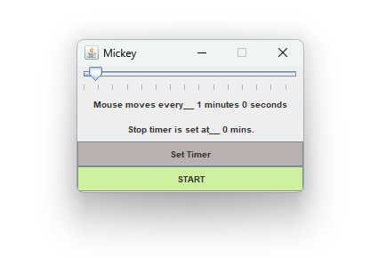

# Mickey

Mickey is a simple Windows application written in Java designed to prevent your computer from hibernating and to maintain an active status in social applications. It does this by simulating the user's activity through a background process that causes the cursor to move slightly from time to time.

 
Mickey application’s GUI featuring start/stop controls and an interval slider for customizing the mouse movement frequency

## Features

- Prevents computer from going into hibernation.
- Keeps your status active in social applications.
- Simple and intuitive GUI with start and timer controls.

## Usage

1. Launch the application by running the JAR or EXE file.
2. The GUI will provide options to start and stop the activity simulation.
3. Adjust the timer settings and use the start button to begin the simulation.
